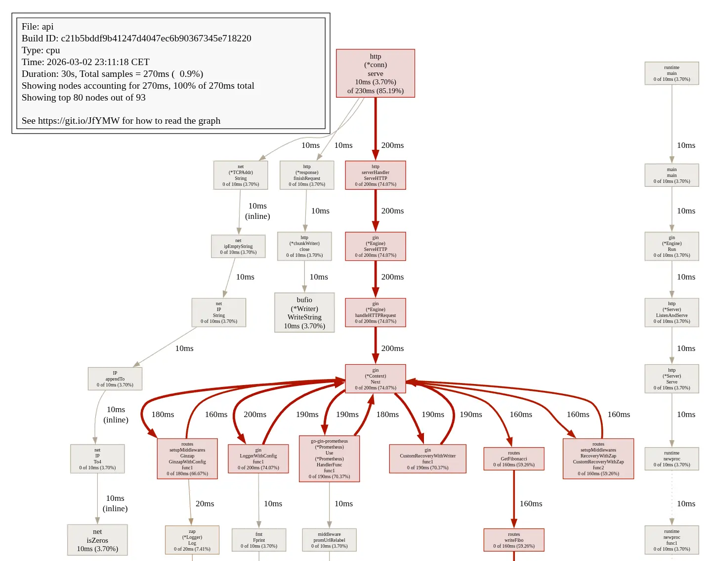

# Developing Fibo

This guide assumes you're using a Linux system.

## Building

### Binary

```sh
go build .
# Outputs binary: ./fibo
```

### Docker image

```sh
docker buildx build -t fibo:latest .
```

## Development

Make sure you have the following tools installed:

- [Golang](https://go.dev/dl/)
- [golangci-lint](https://golangci-lint.run/)
- [pre-commit](https://pre-commit.com/)
- [Docker](https://www.docker.com/)
- [swaggo/swag](https://github.com/swaggo/swag/)

To setup [pre-commit](https://pre-commit.com/), run:

```sh
# Repository root
pre-commit install
```

(Re)build the Swagger documentation with:

```sh
make docs
```

Start the API in live-reload mode:

```sh
air
```

## Profiling

This API supports [pprof](https://github.com/google/pprof).

Restart with `FIBO_DEBUG_ENABLED=true` to enable the pprof Gin middleware. The pprof server will bind the the API's address.

To profile, call:

```sh
go tool pprof http://localhost:8080/debug/pprof/profile\?seconds\=30
```


