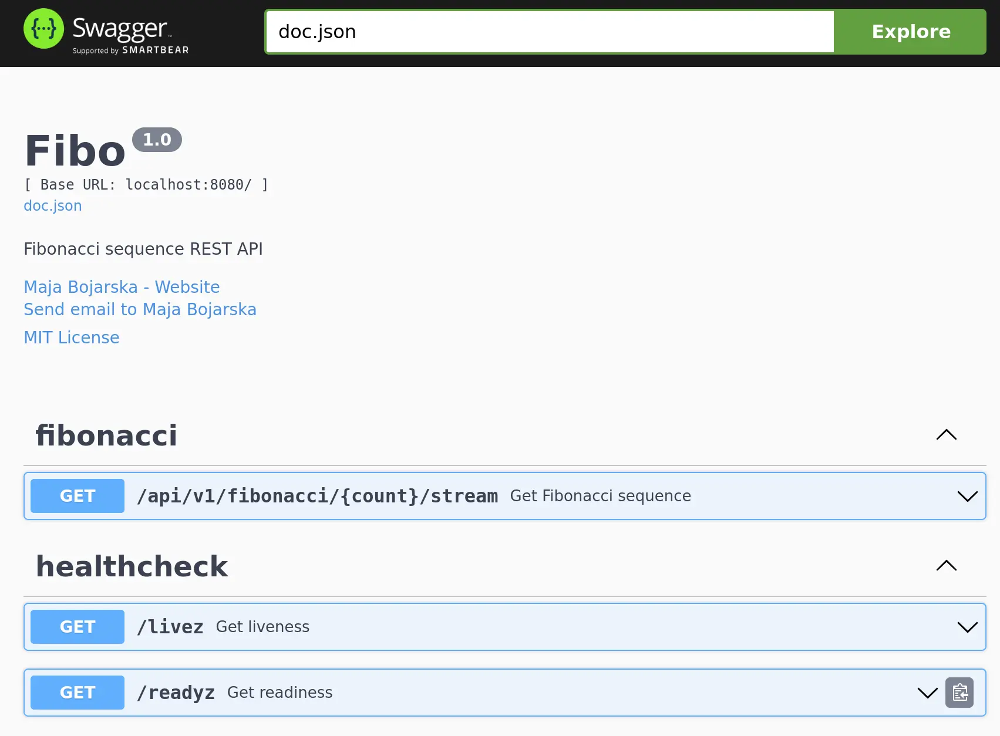

# fibo

## Getting Started

```sh
go run .
```

The web server will bind to `http://localhost:8080/`.

To query a Fibonacci sequence:

```sh
$ curl -s --no-buffer localhost:8080/api/v1/fibonacci/10
# Outputs:
# [0,1,1,2,3,5,8,13,21,34]
```

Swagger API docs can be accessed at http://localhost:8080/swagger/index.html



Prometheus-style metrics are exposed at `/metrics`. This includes Go and Gin (API) metrics.

```plain
$ curl -s localhost:8080/metrics
# HELP gin_request_size_bytes The HTTP request sizes in bytes.
# TYPE gin_request_size_bytes summary
gin_request_size_bytes_sum 0
gin_request_size_bytes_count 0
# HELP gin_response_size_bytes The HTTP response sizes in bytes.
# TYPE gin_response_size_bytes summary
gin_response_size_bytes_sum 0
gin_response_size_bytes_count 0

# ...

promhttp_metric_handler_requests_total{code="200"} 5
promhttp_metric_handler_requests_total{code="500"} 0
promhttp_metric_handler_requests_total{code="503"} 0
```

## Development

See [DEVELOPMENT.md](./DEVELOPMENT.md)

## To-do

Roughly in order of execution:

- Build a REST API around the fibo sequence iterator.
  - Use chunked data https://github.dev/gin-gonic/examples/blob/ec3c1774716d51e4100ae4f995957048d2c86030/otel/main.go
- Add `livez`, `readyz` endpoints.
- Fuzzing tests? https://go.dev/doc/tutorial/fuzz
- Containerize
  - Dockerfile
  - Docker compose
  - Build & run docs in README.md.
- Implement docker image build & release workflow.
  - Triggered on release.
  - Dockerhub
  - (maybe?) Attestations
  - Re-use workflows from [bitwarden-cli-docker/.github/workflows/release.yaml](https://github.com/majabojarska/bitwarden-cli-docker/blob/main/.github/workflows/release.yaml).
- Document the API through an automatically generated OpenAPI specification, in a code-first, docs-second approach. [swaggo/swag](https://github.com/swaggo/swag) will likely be used to achieve this.
- O11y
  - Zap for logging.
  - The REST API will be instrumented with [prometheus/client_golang](https://github.com/prometheus/client_golang).
  - Traces if I have the time to do that.
    - https://github.dev/gin-gonic/examples/blob/ec3c1774716d51e4100ae4f995957048d2c86030/otel/main.go
  - LGTM stack or similar via docker compose.

- Helm chart.
  - Feature parity with docker compose.
