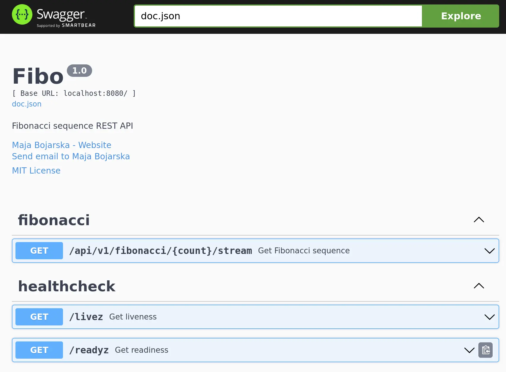
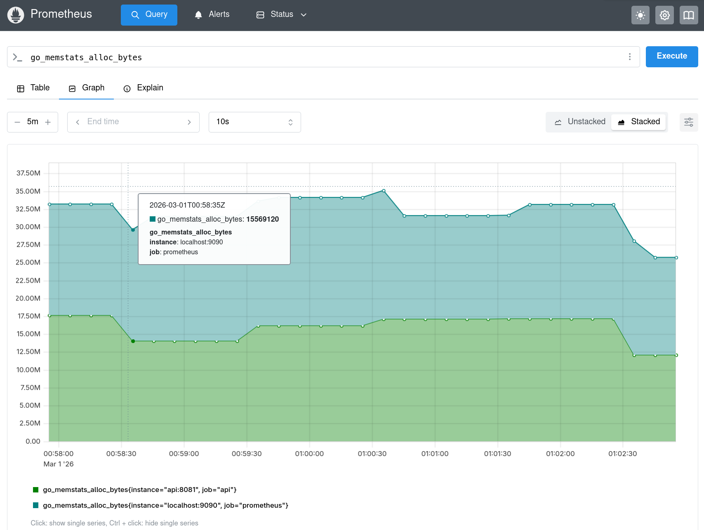

# Fibo

[](https://github.com/majabojarska/fibo/actions/workflows/lint.yml)
[](https://github.com/majabojarska/fibo/actions/workflows/test.yaml)
[](https://github.com/majabojarska/fibo/actions/workflows/build.yaml)
[](https://github.com/majabojarska/fibo/actions/workflows/release-drafter.yaml)

[](https://hub.docker.com/r/majabojarska/fibo/tags)
[](https://hub.docker.com/r/majabojarska/fibo/tags)
[](https://hub.docker.com/r/majabojarska/fibo/tags)

## About

_Fibo_ is a showcase project, implementing a streaming REST API, based on [server-sent events](https://developer.mozilla.org/en-US/docs/Web/API/Server-sent_events/Using_server-sent_events).

## Live demo (hosted)

This service is currently hosted at [fibo.cloud.majabojarska.dev](https://fibo.cloud.majabojarska.dev/) (Swagger docs).

To query (stream) a Fibonacci sequence:

```sh
curl --silent --verbose --no-buffer --header "Accept: text/event-stream" https://fibo.cloud.majabojarska.dev/api/v1/fibonacci/100/stream
```

## Quick Start (local)

```sh
docker compose up
```

The web server will bind to `http://localhost:8080/`.

To query (stream) a Fibonacci sequence:

```sh
curl --silent --verbose --no-buffer --header "Accept: text/event-stream" localhost:8080/api/v1/fibonacci/10/stream
```

Here's a Fibonacci stream example with `api.event_delay: 200ms`, to better demonstrate the principle of operation.

[](https://asciinema.org/a/wzkuKRlfRgfGKEvW)

Swagger API docs can be accessed at http://localhost:8080/swagger/index.html



Prometheus-style metrics are exposed at `/metrics`. This includes Go and Gin (API) metrics.

```plain
curl localhost:9091/metrics
# HELP gin_request_duration_seconds The HTTP request latencies in seconds.
# TYPE gin_request_duration_seconds histogram
gin_request_duration_seconds_bucket{code="200",method="GET",url="/api/v1/fibonacci/100/stream",le="0.005"} 5
gin_request_duration_seconds_bucket{code="200",method="GET",url="/api/v1/fibonacci/100/stream",le="0.01"} 5
gin_request_duration_seconds_bucket{code="200",method="GET",url="/api/v1/fibonacci/100/stream",le="0.025"} 5
gin_request_duration_seconds_bucket{code="200",method="GET",url="/api/v1/fibonacci/100/stream",le="0.05"} 5
gin_request_duration_seconds_bucket{code="200",method="GET",url="/api/v1/fibonacci/100/stream",le="0.1"} 5
gin_request_duration_seconds_bucket{code="200",method="GET",url="/api/v1/fibonacci/100/stream",le="0.25"} 5
gin_request_duration_seconds_bucket{code="200",method="GET",url="/api/v1/fibonacci/100/stream",le="0.5"} 5
gin_request_duration_seconds_bucket{code="200",method="GET",url="/api/v1/fibonacci/100/stream",le="1"} 5
gin_request_duration_seconds_bucket{code="200",method="GET",url="/api/v1/fibonacci/100/stream",le="2.5"} 5
gin_request_duration_seconds_bucket{code="200",method="GET",url="/api/v1/fibonacci/100/stream",le="5"} 5
gin_request_duration_seconds_bucket{code="200",method="GET",url="/api/v1/fibonacci/100/stream",le="10"} 5
gin_request_duration_seconds_bucket{code="200",method="GET",url="/api/v1/fibonacci/100/stream",le="+Inf"} 5
gin_request_duration_seconds_sum{code="200",method="GET",url="/api/v1/fibonacci/100/stream"} 0.004046882
gin_request_duration_seconds_count{code="200",method="GET",url="/api/v1/fibonacci/100/stream"} 5
```

The Prometheus UI is available at `localhost:9090`.



## Configuration

This API uses [Viper](https://github.com/spf13/viper) for configuration management.

- Configuration is possible both through a config file, and environment variables.
- Defaults are available for every configuration item.
- The config file takes precedence over environment variables, whenever the same config item is defined through both.
- The config file location is non-configurable at the moment, and evaluates to the `$PWD` of the process.

### Config file

See [./fibo.yaml](./fibo.yaml) for reference.

Example:

```yaml
api:
  addr: ":8080"
  allow_origins:
    - "http://localhost"
  event_delay: 0ms

docs:
  enabled: true

logging:
  level: "info"

metrics:
  enabled: true
  addr: ":9091"
  path: "/metrics"

debug:
  enabled: false
```

See the [Zap documentation](https://pkg.go.dev/go.uber.org/zap#AtomicLevel.UnmarshalText) for a reference of Zap log level string identifiers.

### Environment variables

| Name                     | Description                                                                                                                                                                                 | Type                                                       | Default                             |
| ------------------------ | ------------------------------------------------------------------------------------------------------------------------------------------------------------------------------------------- | ---------------------------------------------------------- | ----------------------------------- |
| `FIBO_API_ADDR`          | REST API bind address                                                                                                                                                                       | string                                                     | `":8080"`                           |
| `FIBO_API_ROOT_URL`      | URL through which the API will be externally available                                                                                                                                      | string                                                     | `"http://localhost:8080"`           |
| `FIBO_API_ALLOW_ORIGINS` | Populates the [`Access-Control-Allow-Origin`](https://developer.mozilla.org/en-US/docs/Web/HTTP/Reference/Headers/Access-Control-Allow-Origin) header. Comma-separated for multiple values. | []string                                                   | `"http://localhost,http://a.b.c.d"` |
| `FIBO_API_EVENT_DELAY`   | Time to wait between subsequent stream events                                                                                                                                               | string ([Duration](https://pkg.go.dev/time#ParseDuration)) | `"0s"`                              |
| `FIBO_DOCS_ENABLED`      | Enables the REST API docs server (Swagger)                                                                                                                                                  | bool                                                       | `true`                              |
| `FIBO_METRICS_ENABLED`   | Enables the Prometheus metrics server                                                                                                                                                       | bool                                                       | `true`                              |
| `FIBO_METRICS_ADDR`      | Metrics server bind address                                                                                                                                                                 | string                                                     | `":9091"`                           |
| `FIBO_METRICS_PATH`      | Metrics server base URL                                                                                                                                                                     | string                                                     | `"/metrics"`                        |
| `FIBO_LOGGING_LEVEL`     | Log level                                                                                                                                                                                   | string                                                     | `"info"`                            |
| `FIBO_DEBUG`             | Enables debug mode (Gin, Zap), starts pprof.                                                                                                                                                | bool                                                       | `false`                             |

## Development

See [DEVELOPMENT.md](./DEVELOPMENT.md)
